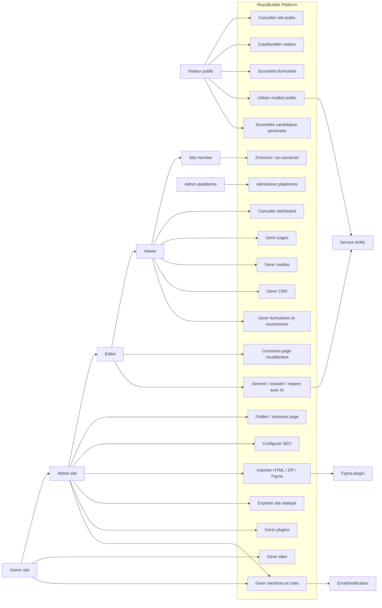

# ReactBuilder - Diagramme de cas d'utilisation global

## Perimetre

ReactBuilder est une plateforme SaaS multi-tenant de creation de sites web assistee par IA.
Le systeme couvre la gestion des sites, pages, medias, CMS, formulaires, membres, plugins,
exports, import HTML/Figma, analytics, chatbot public et espace visiteur.

## Acteurs

- **Visiteur public**: consulte un site publie, soumet des formulaires, utilise le chatbot, peut creer une session membre visiteur.
- **Site member**: utilisateur authentifie rattache a un site.
- **Viewer**: consulte le tableau de bord, les pages, medias, plugins et membres.
- **Editor**: cree/modifie pages et medias.
- **Admin site**: administre contenu, plugins, applications partenaires et invitations.
- **Owner site**: possede le site, gere les roles, les parametres et la suppression.
- **Admin plateforme**: supervise la plateforme, les utilisateurs, les sites, les plugins, les logs et les validations.
- **Figma plugin**: importe des designs/tokens depuis Figma.
- **Service IA/ML**: genere, repare, analyse et assiste la creation de contenu.
- **Service email/notification**: envoie invitations et notifications.

## Hypotheses de conception

- Les roles **Owner**, **Admin**, **Editor** et **Viewer** sont des specialisations de **Site member**.
- Les permissions sont par site: un meme utilisateur peut avoir un role different selon le site.
- Les visiteurs publics ne sont pas des membres back-office; l'authentification visiteur sert aux pages `members_only`.
- L'IA, Figma, email et ML sont des systemes externes ou sous-systemes integres, pas des utilisateurs humains.
- Le diagramme global reste volontairement macro. Les CRUD detailles doivent etre traites dans des diagrammes par module.

## Diagramme PlantUML

```plantuml
@startuml
left to right direction
skinparam packageStyle rectangle

actor "Visiteur public" as Visitor
actor "Site member" as Member
actor "Viewer" as Viewer
actor "Editor" as Editor
actor "Admin site" as SiteAdmin
actor "Owner site" as Owner
actor "Admin plateforme" as PlatformAdmin
actor "Figma plugin" as Figma
actor "Service IA/ML" as AI
actor "Service email/\nnotification" as Notify

Member <|-- Viewer
Viewer <|-- Editor
Editor <|-- SiteAdmin
SiteAdmin <|-- Owner

rectangle "ReactBuilder Platform" {
  usecase "S'inscrire / se connecter" as UCAuth
  usecase "Gerer profil et securite" as UCProfile
  usecase "Consulter sites accessibles" as UCListSites
  usecase "Creer site" as UCCreateSite
  usecase "Configurer site\n(settings, layout global)" as UCConfigureSite
  usecase "Supprimer / suspendre site" as UCDeleteSite

  usecase "Consulter dashboard\nanalytics & activite" as UCDashboard
  usecase "Gerer pages" as UCPages
  usecase "Construire page visuellement" as UCBuilder
  usecase "Publier / restaurer page" as UCPublish
  usecase "Configurer SEO" as UCSeo
  usecase "Importer HTML / ZIP" as UCImport
  usecase "Importer depuis Figma" as UCFigmaImport
  usecase "Exporter site statique" as UCExport

  usecase "Gerer medias" as UCMedia
  usecase "Gerer CMS\ncollections, fields, entries" as UCCms
  usecase "Gerer formulaires" as UCForms
  usecase "Consulter soumissions" as UCSubmissions
  usecase "Gerer membres et roles" as UCMembers
  usecase "Inviter membre" as UCInvite
  usecase "Gerer plugins marketplace" as UCPlugins
  usecase "Gerer notifications" as UCNotifications
  usecase "Reviser applications partenaires" as UCPartnerReview

  usecase "Generer site / sections / SEO" as UCAIGenerate
  usecase "Assistant / copilot design" as UCAssistant
  usecase "Analyser / reparer page" as UCAIRepair
  usecase "Consulter historique IA" as UCAIHistory

  usecase "Consulter site public" as UCPublicSite
  usecase "Consulter page publique" as UCPublicPage
  usecase "S'authentifier comme visiteur" as UCVisitorAuth
  usecase "Soumettre formulaire public" as UCPublicForm
  usecase "Utiliser chatbot public" as UCChatbot
  usecase "Soumettre candidature partenaire" as UCPartnerApply

  usecase "Administrer utilisateurs" as UCAdminUsers
  usecase "Valider / rejeter utilisateurs" as UCApproveUsers
  usecase "Superviser sites" as UCAdminSites
  usecase "Superviser plugins" as UCAdminPlugins
  usecase "Consulter logs et stats IA" as UCAdminLogs
  usecase "Configurer plateforme" as UCPlatformSettings
}

Visitor --> UCPublicSite
Visitor --> UCPublicPage
Visitor --> UCVisitorAuth
Visitor --> UCPublicForm
Visitor --> UCChatbot
Visitor --> UCPartnerApply

Member --> UCAuth
Member --> UCProfile
Member --> UCListSites
Member --> UCNotifications

Viewer --> UCDashboard
Viewer --> UCPages
Viewer --> UCMedia
Viewer --> UCCms
Viewer --> UCForms
Viewer --> UCPlugins
Viewer --> UCMembers

Editor --> UCPages
Editor --> UCBuilder
Editor --> UCMedia
Editor --> UCCms
Editor --> UCForms
Editor --> UCAIGenerate
Editor --> UCAssistant
Editor --> UCAIRepair

SiteAdmin --> UCPublish
SiteAdmin --> UCSeo
SiteAdmin --> UCImport
SiteAdmin --> UCFigmaImport
SiteAdmin --> UCExport
SiteAdmin --> UCSubmissions
SiteAdmin --> UCInvite
SiteAdmin --> UCPlugins
SiteAdmin --> UCPartnerReview

Owner --> UCCreateSite
Owner --> UCConfigureSite
Owner --> UCDeleteSite
Owner --> UCMembers

PlatformAdmin --> UCAdminUsers
PlatformAdmin --> UCApproveUsers
PlatformAdmin --> UCAdminSites
PlatformAdmin --> UCAdminPlugins
PlatformAdmin --> UCAdminLogs
PlatformAdmin --> UCPlatformSettings
PlatformAdmin --> UCExport

UCPages .> UCBuilder : <<include>>
UCPages .> UCSeo : <<include>>
UCPublish .> UCNotifications : <<extend>>
UCInvite .> UCNotifications : <<include>>
UCInvite .> Notify : <<include>>
UCAIGenerate .> AI : <<include>>
UCAssistant .> AI : <<include>>
UCAIRepair .> AI : <<include>>
UCFigmaImport .> Figma : <<include>>
UCChatbot .> AI : <<include>>
UCPartnerApply .> UCNotifications : <<extend>>
UCPartnerReview .> UCNotifications : <<extend>>
UCVisitorAuth .> UCPublicPage : <<extend>>
UCForms .> UCPublicForm : <<extend>>
UCCms .> UCPublicPage : <<extend>>
UCPlugins .> UCChatbot : <<extend>>
UCPlugins .> UCSeo : <<extend>>
UCPlugins .> UCAIHistory : <<extend>>

@enduml
```

## Version Mermaid simplifiee

Mermaid ne gere pas nativement les use-case UML comme PlantUML. Cette version sert pour une vue rapide.

## Points a verifier avant validation finale

- Est-ce que **Admin plateforme** correspond a un vrai role applicatif separe, ou seulement a `ADMIN` global?
- Est-ce que **Partner application** fait partie du coeur ReactBuilder ou d'un module metier specifique a un client?
- Est-ce que l'export statique est accessible aux admins site seulement, ou aussi aux owners/editors?
- Est-ce que le visiteur authentifie peut avoir un espace profil complet, ou uniquement acceder aux pages protegees?
